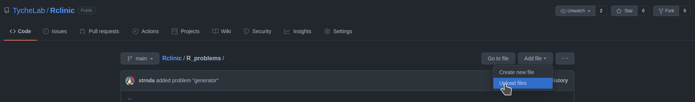
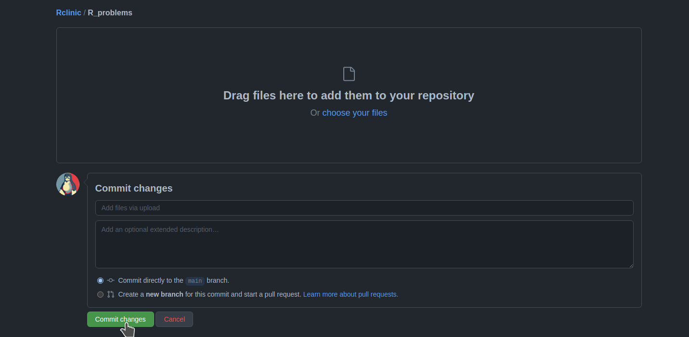

# Content 
1. [Why do the R clinic](#why)
2. [How the R clinic works ](#how)
3. [Guide on how to post problems](#guide)
4. [Contributing solutions](#solutions) 
5. [Code of Conduct](#CoC)
 
# R clinic *test repo*

This repository will hold questions about problems using **R**, submitted by users, who
are working in hydrological sciences. The questions will be turned into solutions,
which will be stored in the same repository, providing a library of solutions
to **R** problems. 


# Why do the R clinic  <a name="why"></a>

There are lots of resources for learning about R, from webinars to YouTube videos. These all give good introductions to R. However, people often have trouble when they are actually using R in their work. They need to do something, and can't figure out how to do it and we think that this is where we could make a real contribution. The idea would be to conduct an R clinic, taking people through the solutions of real world problems. 


# How the R clinic works  <a name="how"></a>

Anybody who wishes to submit a question on how to use R to solve a real problem in hydrology, climatology and environmental sciences can submit a question. This should happen via a pull request as explained in the guide below. The deadline for the question submission is **October 24th**. After that, there will be some sifting through the questions and the different problems will be assigned to the volunteers who wish to take charge of the solution. A live streaming session in which the solutions to the problems will be presented and discussed will take place on **November 4th**. 

This is the first time the R clinic is organised, so some adjustments might be needed as we go along - bear with us!


# Guide on how to post problems  <a name="guide"></a>

Please make a copy of the file `"R_problem.Rmd"`, with a new name, which
explains your issue, such as `"get_yearly_monthly_mean_values.Rmd"`. This
is a file written in **Rmarkdown**, which is used to create **R** notebooks.
You can edit these files in **RStudio**, or in any text editor.
More information about **Rmarkdown** is available from 

Fill in the new document, explaining your issue, and providing examples of
the code which is causing problems, or isn't working.

The document has the following sections to be filled in.

* **Name and email**: These are optional, but will enable us to contact you if there are any
questions. All names and emails will be deleted from the .Rmd files when
the solutions are posted.

* **Data** Your examples will probably need some data. Please describe the data set here.
Note that there are many built-in data sets, which you can see using the
`data()` command. If you do need to include a data set, please make it as 
small as possible. Also, please omit the path to the file, as the data
file will be stored in the same location as the problem .Rmd file.  
You can also can also read data from a URL:
`dataframe <- read.csv("http://some.site.net/data/daily_flows.csv")`   
Please ensure that none of the data you submit contains any confidential information.

* **Problem statement** Please be as specific as possible, so that we can best understand the issue.
A good problem statement would be something like:  
"When I try to do this, I get x. However, I'm really trying to get y".  
or  
"Given a data frame of daily dates and flow values, how do I get monthly and yearly mean values by the hydrological year?"  

* **Example(s)** The example(s) of the problem are placed in an R "chunk", which is everything
between the "\`\`\`{r}" and "\`\`\`". Please include lots of comments, either before 
or after the chunk, or inside the chunk prefaced with "#", e.g.:  
`This example gives mean values by calendar month (Jan, Feb, etc.) for all years, but
I need mean values by hydrological year and month.`  

 ```{r}   
 `# This statement gives me means by month`  
 
`flows$monthly <- aggregate(flows$daily_flow, by = flows$month, FUN = "mean")`

  ```    
  
* **Uploading the problem** Your problems can be submitted by using standard git workflow (forking the repo and submitting a pull request), or manually uploading the \*.Rmd file to the "R_problems" directory using the **Add file** button and than simply click on **Commit changes** as shown on the pictures bellow


<center></center>

---

<center></center>


* **If you are stuck**: you can contact Strnad Filip (strnadf@fzp.czu.cz), but keep in mind that we expect problems to be submitted as issues and not as emails. 

# Contributing solutions  <a name="solutions"></a> 

Anybody can contribute solutions to the submitted problems! Once all problems are submitted, a github issue will be opened for each problem: there the clinic coordinators and any other volunteer can discuss possible solutions and can assign each problem to a specific person who will then be responsible for finalising the solution which will be uploaded as the final solution. Typically the assignee would be a member of the clinic team, but any other volunteer with knowledge of how to solve any of the problems and willing to contribute can add to the issue discussion and eventually be responsible for the final solution. 


# Code of conduct  <a name="CoC"></a>

All users involved in the clinic, either by sumbitting questions or contributing solutions, are required to follow the proejct's [code of conduct](https://github.com/strnda/clinic_test_repo/blob/main/CODE_OF_CONDUCT.md). By contributing to this project, you agree to abide by its terms.
